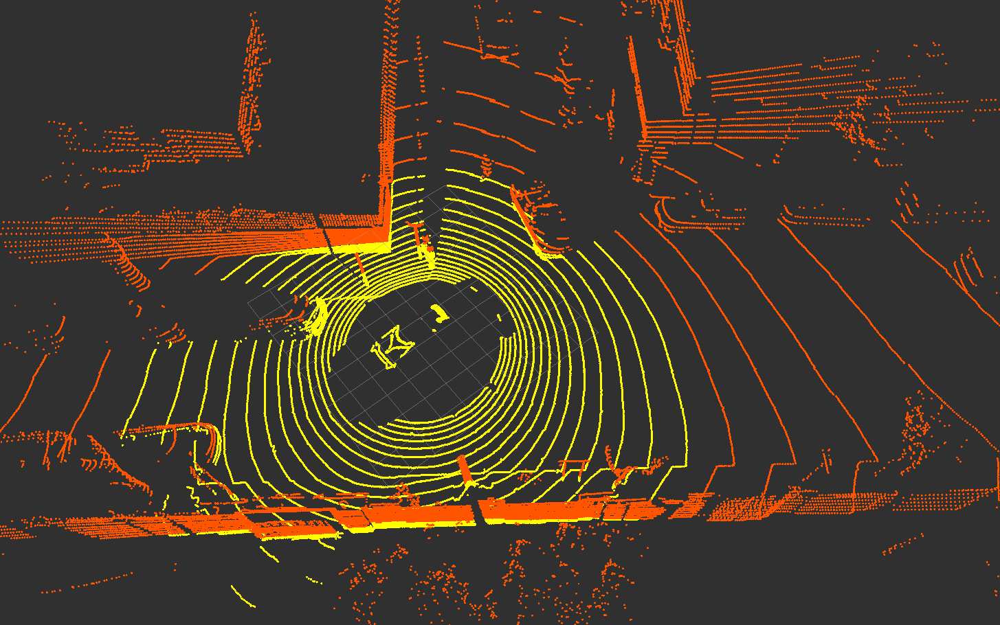
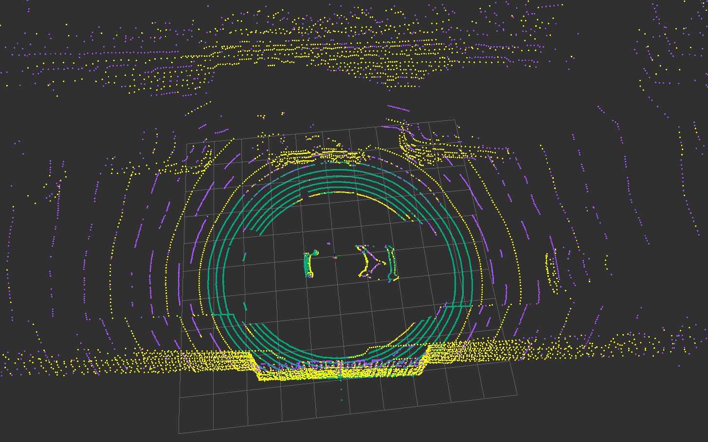
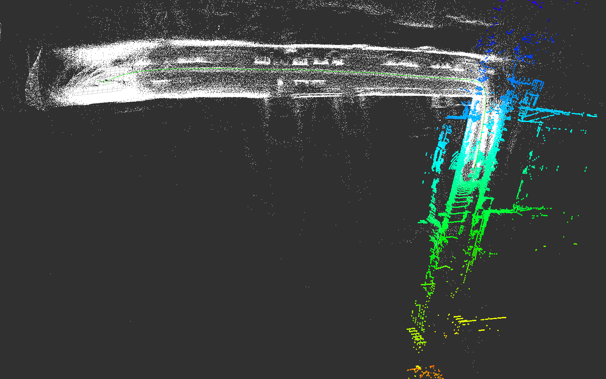
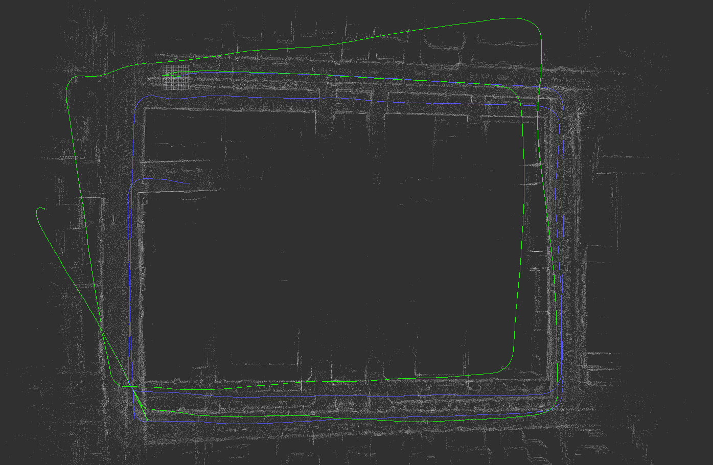
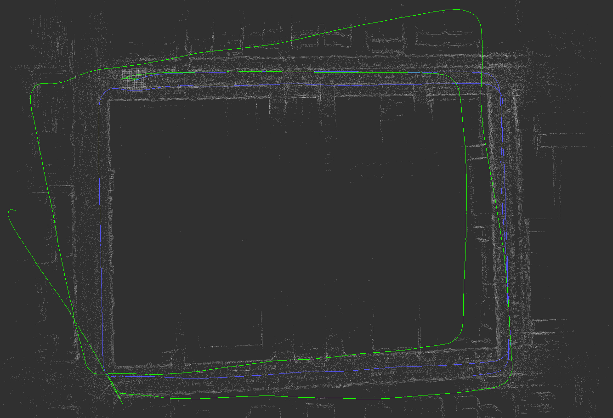
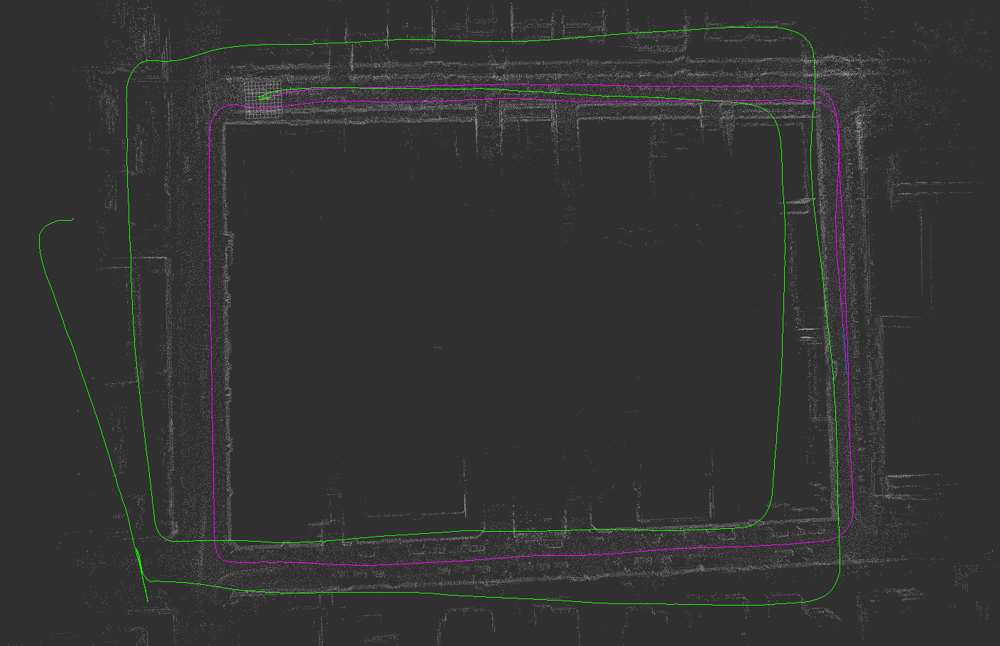
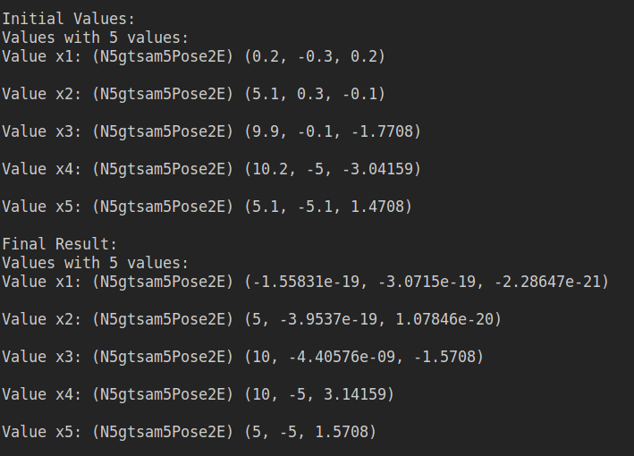
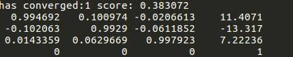

# one_liom

3D激光点云常见处理方法，包括曲率计算，提取线面特征，构建点面残差推算里程计，帧与局部地图匹配，构建地图等

#### one_liom1

将点云根据线数分为上下两个部分

#### one_liom2

曲率计算和线面特征提取

#### one_liom3

根据点面距离建立残差，利用ceres构建优化问题计算帧间里程计(里程计坐标系)

#### one_liom4

根据点面距离建立残差，利用ceres构建优化问题计算世界坐标系下某个点的四元数和位移，输出路径和地图(世界坐标系)

#### one_liom5
根据点面距离建立残差，利用ceres构建优化问题，利用KD树寻找当前帧最近的几帧构建局部地图，累积一定帧数保存局部地图，输出路径和地图(世界坐标系)

#### one_liom6
将帧间里程计因子和闭环因子加入到gstam graph，优化位姿，输出gtsam优化后的轨迹

#### test_gtsam
gtsam对于二维位姿的使用

#### test_icp
icp点云矫正

